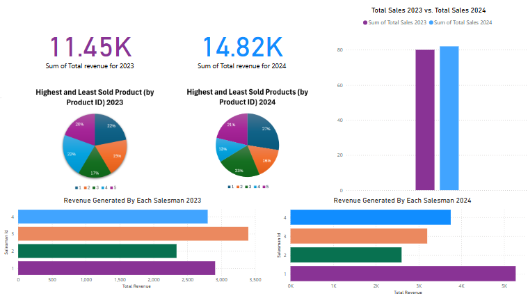

# Retail Store Performance Analytics 📊📈

This project focuses on developing a SQL database that efficiently manages and analyzes data for a retail store. Specifically, comparing the sales, products sold, and sales personnel performance between January/Febuary of 2023 to January/February of 2024. This project aims to provide valuable business insights by uncovering patterns such as top-performing products and salesperson effectiveness. The overall perfomance is showcase through the Power Bi dashboard.

## Visual Display of the Performance

## License

[MIT](https://choosealicense.com/licenses/mit/)

